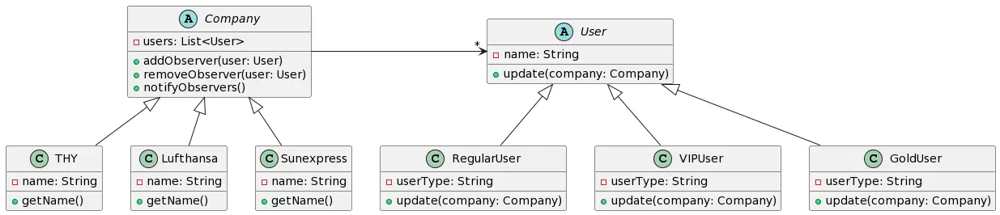
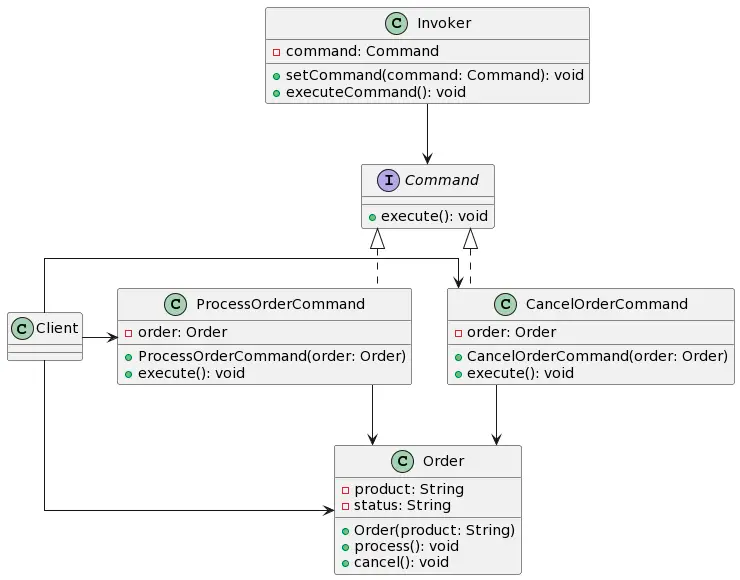

# SM523 Assignment3

This repo includes all the source code for the third assignment in Java and the relevant UML diagrams in PlantUML. The diagrams can also be found in
jpg.

## Case 1-Observer

In the first case, I used Observer pattern to notify users about discounts in airline companies when there is a change in companies' state. This
allows for a loosely coupled design and it is easy to add new companies and users in the future. Both of them can evolve independent of each
other.

The application notifies the users about discounts in airline companies. The Observer pattern allows the system to achieve this by having the
companies (the subjects) notify their registered users (the observers) when a discount is available.

Below you can see the UML diagram.

## Case 2-Command

In the second case, I used Command pattern to deal with the cancellation efficiently after an order is processed. This way, the logic of the request
is separated form the object that performs it. Therefore, the request logic can be changed or extended without modifying the object that performs it,
making the system loosely coupled.

The Command design pattern is a behavioral design pattern that encapsulates a request as an object, allowing for the separation of an object making a
request from the one that knows how to perform it. This pattern is particularly useful when you want to parametrize objects with different operations,
in this case it is an undo operation.

For the second case, the command pattern was used to separate the logic of processing and canceling an order from the Order class, and encapsulated it
in separate command classes ProcessOrderCommand and CancelOrderCommand respectively. We can alter the commands without changing Order.

Below you can see the UML diagram.

## Case 3-Chain of Responsibility

In the third case, I have used the chain of responsibility pattern to handle the package delivery logic. Each distribution station in the network has
the opportunity to handle the package if its capacity allows it. If not, it sends the package to the next distribution station in chain.

The Chain of Responsibility pattern decouples the sender of a request from the object that handles it. Instead of having the sender
directly call the method on the object that should handle the request, the sender sends the request to a chain of objects, and each object in the
chain handles the request one by one.

Order of the chain can be changed or different chains for different purposes can be built. Also request handling logic can be modified for further
different use cases.

